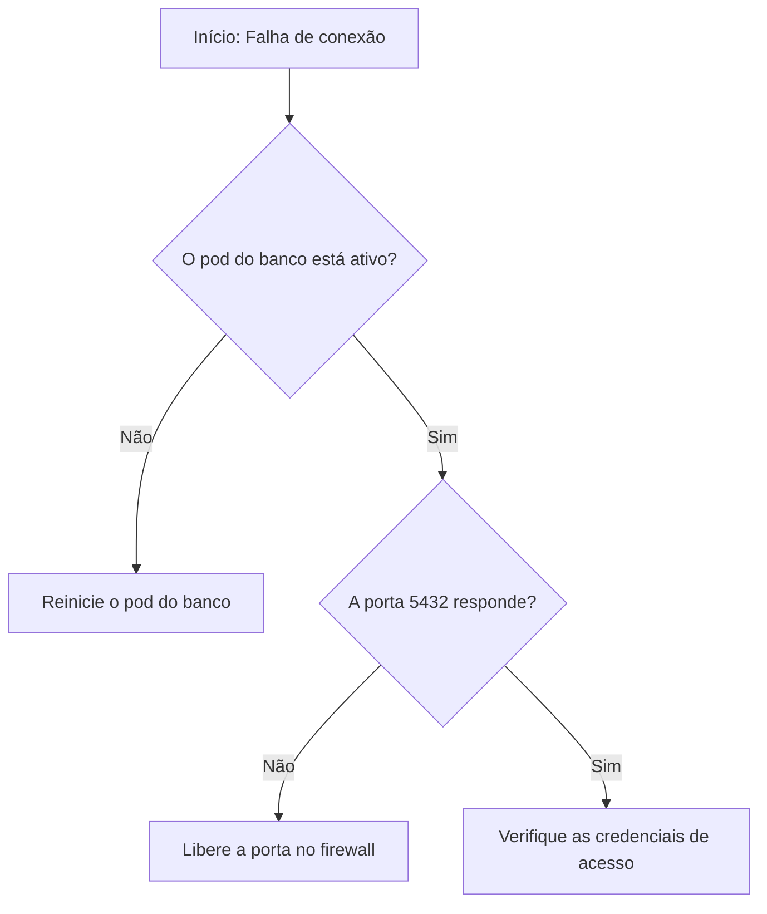

# Exemplos: Comunicação de Agentes no Hermes

Este documento mostra padrões de escrita em PTS para equipes de agentes no Hermes.
Os exemplos cobrem mensagens de transferência, revisão em formato de comparação e diagramas técnicos.

## Exemplo 1: Transferência técnica entre agentes (Handoff)

### Mensagem com prolixidade de IA (Não PTS)

> Olá! Certamente posso ajudar com a implantação do microsserviço. Vale destacar que executei todos os testes unitários com sucesso e o build da imagem Docker foi realizado sem nenhum erro. É importante notar que o cluster Kubernetes precisará de atenção especial, pois as variáveis de ambiente deveriam ser configuradas antes do deploy. Em suma, passei a tarefa para você. Fique à vontade para me chamar se precisar de qualquer ajuda!

### Mensagem em PTS (Hermes)

> ### Transferência Técnica: Microsserviço de Pagamentos
> - **Objetivo**: Implantar o microsserviço no cluster de homologação.
> - **Status**: Testes unitários concluídos com sucesso.
> - **Imagem**: registry.local/pagamentos:v1.4.2
> - **Ação Requerida**: Configure as variáveis de ambiente no Kubernetes e execute o deploy do serviço.

As regras aplicadas:
- Remoção total de saudações e despedidas de cortesia (Regra 1.17).
- Remoção de clichês de transição como "Vale destacar que" e "É importante notar que" (Regra 1.17).
- Remoção de emojis (Regra 1.17).
- Estruturação em tópicos para economia de tokens e leitura direta por agentes.

## Exemplo 2: Modo de comparação com justificativa (Diff)

Quando um agente revisa o texto de outro agente ou do usuário, o agente deve apresentar a comparação estruturada.

| Texto Original | Texto em PTS | Violações Corrigidas |
|---|---|---|
| Recomenda-se efetuar o backup da base de dados antes de iniciar o procedimento. | Antes de começar o procedimento, faça uma cópia de segurança do banco de dados. | Regra 3.8 (passiva com "-se"), Regra 3.7 (verbo de suporte "efetuar"), Regra 1.15 (estrangeirismo "backup"). |
| Vale ressaltar que os pods estão reiniciando constantemente devido à falta de memória. | Os pods reiniciam porque a memória da máquina acabou. | Regra 1.17 (clichê "Vale ressaltar que"), Regra 3.5 (gerúndio "reiniciando"), Regra 1.16 ("devido à"). |
| O operador deveria verificar se a porta 8080 foi aberta pelo firewall. | O firewall abriu a porta 8080? Verifique o firewall. | Regra 3.9 (futuro do pretérito "deveria"), Regra 3.6 (voz passiva com agente). |

## Exemplo 3: Além do texto puro (Mermaid e tabela de diagnóstico)

Procedimentos com bifurcações devem usar diagramas Mermaid e tabelas estruturadas.

### Fluxo de decisão: Falha na conexão com o banco

### Tabela de diagnóstico em 3 colunas

| Sintoma | Causa Provável | Ação Corretiva |
|---|---|---|
| Pod em estado CrashLoopBackOff | Memória insuficiente | Aumente o limite de memória no manifesto. |
| Erro de tempo limite na porta 5432 | Bloqueio de rede no firewall | Crie a regra de liberação no Security Group. |
| Erro de autenticação recusada | Senha incorreta no Secret | Atualize a chave no cofre de senhas. |
